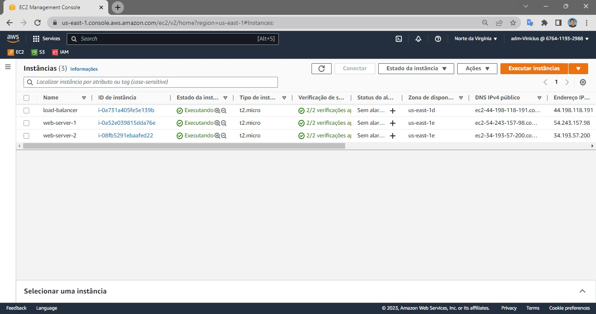
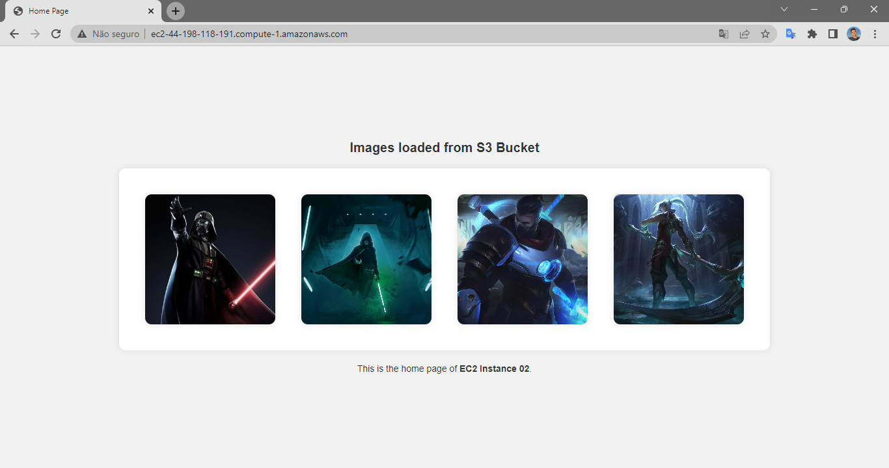

# Projeto AWS
Integração dos serviços EC2 e S3 da plataforma **Amazon Web Services (AWS)**

## O que foi feito

### Visão geral das EC2 criadas
Foram instanciadas ao todo três máquinas virtuais (sistema operacional Ubuntu) no AWS EC2, sendo elas:
1. **Duas máquinas idênticas funcionando como réplicas**, com NGINX instalado para execução de um servidor web simples que carrega algumas imagens armazenadas como objetos dentro de um bucket do AWS S3. 
2. **Uma terceira instância criada também com NGINX porém para balanceamento de carga**, distribuindo as requisições recebidas para essas duas máquinas réplicas. 

*O NGINX em ambas as máquinas é executado na porta 80 e apenas a máquina balanceadora de carga está autorizada a receber requisições http de qualquer IP.*

### IPs Elásticos
Para cada uma das máquinas instânciadas foi atribuído um IP Elástico, para que assim, elas possam ter **IP e DNS fixos** para consolidar as comunicações e não gerar problemas caso uma das máquinas seja reinstanciada. 

### Grupos de segurança (security groups)
O **security group criado para as máquinas que hospedam o servidor web** (as instâncias réplicas) permite apenas a entrada de requisições na porta 80 (via HTTP) das máquinas, e tais requisições devem vir, para serem aceitas, do IP elástico definido para a instância balanceadora de carga. 

Já o **security group do Load Balancer** aceita requisições HTTP na porta 80 de qualquer IP. Ambos os security groups podem ter saída de tráfego de qualquer porta, com qualquer protocolo e para qualquer IP. 

*Ambas as máquinas estavam com SSH habilitado para conexão remota do terminal local com os terminais das máquinas.*

### Configuração da aplicação executada em cada instância
Para configuração das máquinas, ou seja, instalação e configuração do NGINX para rodar conforme o desejado, foi clonado este repositório em cada uma delas e, de acordo com a finalidade da máquina (web-server ou load-balancer), foi executado via bash o respectivo arquivo *init.sh*.

## Resultados
Ao acessar o DNS público do IP Élástico da **instância balanceadora de carga**, o conteúdo **index do servidor web** hospedado na máquina **réplica 01** é apresentado, carregando objetos (as imagens) armazenadas no Bucket S3:

Ao recarregar a página, ou seja, enviar uma nova requisição de conteúdo para a máquina balanceadora de carga, o conteúdo da máquina réplica 02 é apresentado. 

Ao recarregar novamente, a requisição é enviada à máquina 01 e por ai em diante. Ou seja, para cada requisição, o Load Balancer redireciona a requisição para uma das duas máquinas de forma alternada:

*O texto que difere as duas páginas foi escrito para identificação de qual máquina está hospedando o conteúdo mostrado.*

*Como em situações práticas a ideia é ter o mesmo conteúdo em cada máquina, aqui foi feito desse jeito apenas para exemplificação do funcionamento do projeto.*

*Os html utilizdos foram desenvolvidos com o auxílio do ChatGPT e as imagens foram provenientes do Google.*

*Como o projeto é de fins educaionais, as imagens e as instâncias foram removidas da AWS para não gerarem custos (os recursos utilizados foram do aws free tier).*